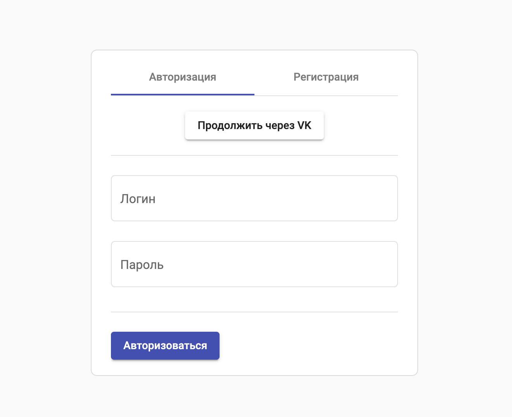
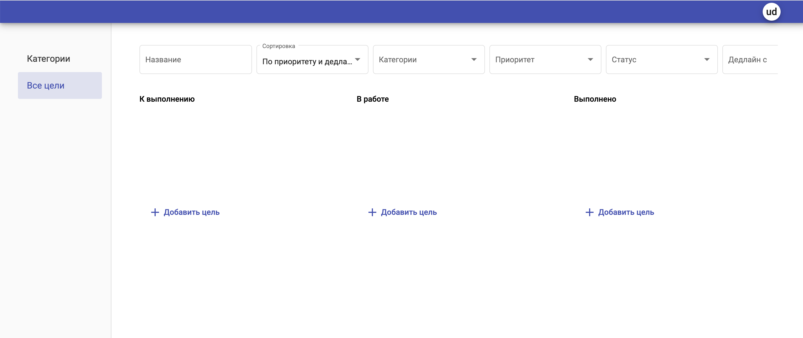

<h1>Todolist - проект веб-приложения — планировщика задач</h1>

<h2>Описание проекта</h2>

Приложение: http://158.160.68.218

Стартовая страница приложения предлагает следующие действия:

Регистрация, вход для авторизованных пользователей, а также вход через социальную сеть VK

Авторизованые пользователи попадают в личный кабинет

В своем профиле пользователь может:

<ul>
 <li>изменять свои данные и обновлять пароль;</li>
 <li>создавать доски для целей и делиться ими с другими пользователями;</li>
 <li>создавать цели и категории целей на досках;</li>
 <li>получать цели по разным параметрам (категория, важность, дедлайн и т.д.).</li>
</ul>

При разделении доступа к доске другие пользователи могу осуществлять ряд действий согласно своим правам доступа (редактор, читатель).

В приложении создан телеграм бот: https://t.me/todolist_goals_bot.

Бот верифицируется по коду и с его помощью можно:

<ul>
<li>получать свои цели;</li>
<li>создавать новую цель.</li>
</ul>

<h2>Техническое описание проекта:</h2>
<h3>Стек: python3.9, Django4.0.1, Postgres</h3>

Запуск:

<ol>
<li>Выполнить установку зависимостей.</li>
<li>Заполнить .env.</li>
<li>Запустить проект с помощью команды docker-compose up.</li>
</ol>

